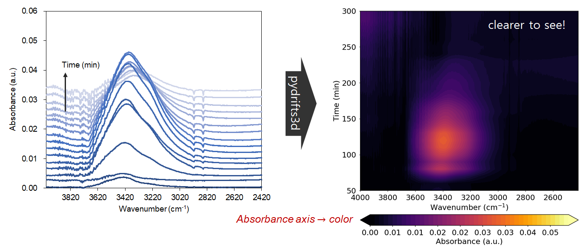
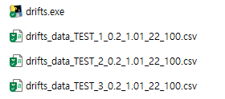
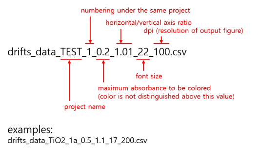
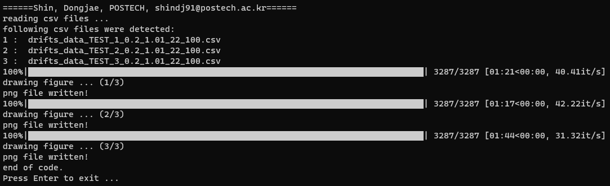
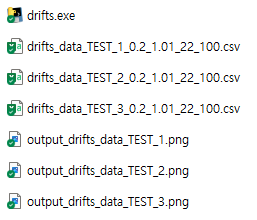
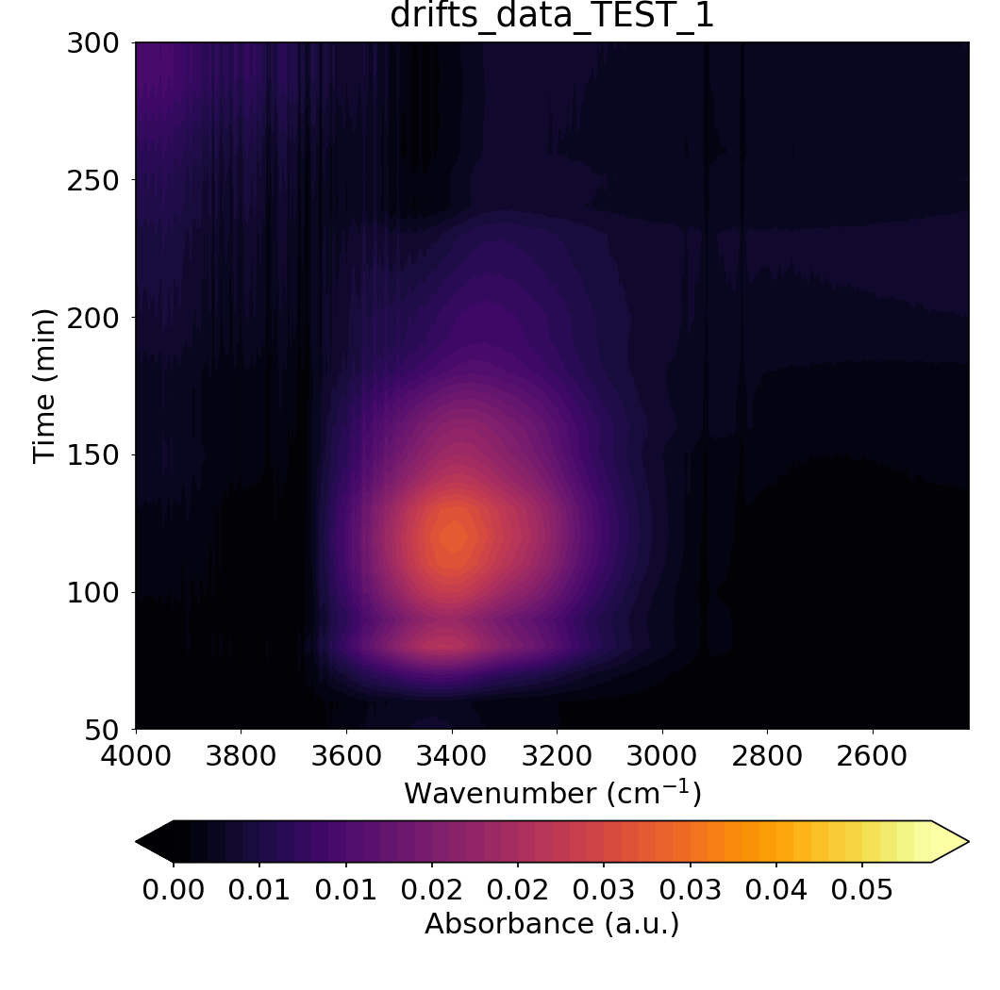

# Introduction: pydrifts3d
`pydrifts2d` is a python code to convert the experimental raw spectra data from DRIFTS (Diffuse Reflectance Infrared Fourier Transform Spectroscopy) to three dimensional plot. Multiple DRIFTS plots can be automatically generated according to the used-defined plotting parameters.  

  

# How to use
## Way 1. Using executable file in Windows
1) Download executable file (drifts.exe) from the link:  
https://www.dropbox.com/s/39ubk45g0n2wp9k/drifts.exe?dl=0
2) Put (multiple) DRIFTS files (csv format) in the same directory of the executable file (See the example DRIFTS raw input file in this repository.).  
  
Input files' names should be in the following format (This way, the plotting parameters can be set here.):  
  
4) Run the executable file by double-clicking (It takes ~30 to 60 seconds before something first pops up, depending on the running environment).  
  
5) Output png files are generated.  
  
Example plot result:  
<p align="center">  </p>  

## Way 2. Using python code in Linux
1) Download the `drifts.py` file from this repository.
2) Put (multiple) DRIFTS files (csv format) in the same directory of the executable file in Linux.
3) Run the code by typing:  
```$ python drifts.py```  
It may run faster than in Windows.
4) Output png files are generated.

## Applications of this code
`pydrifts3d` has been utilized in many scientific papers, especially in the field of catalysis:
1. *ACS Catal.* 2022, 12, 8, 4402–4414 (https://doi.org/10.1021/acscatal.2c00476)   
2. *J. Mater. Chem. A*, 2022, 10, 24995-25008 (https://doi.org/10.1039/d2ta08217a)
3. *Catal. Sci. Technol.*, 2023, Advance Article (https://doi.org/10.1039/D3CY00551H)
